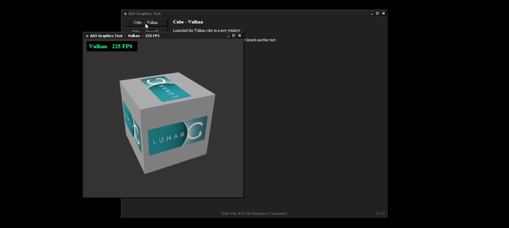

# PanVK for Mali-G52 MC2 — Kbase/JM

Experimental Mesa PanVK work for running Vulkan on a **Mali-G52 MC2 (Bifrost / Job Manager)** through the proprietary **`mali_kbase`** kernel driver, without a DRM render node and without root.

The project currently targets the **Xiaomi Redmi 13C (MT6769V/CZ / mt6768)** and is developed directly on Android with Termux.

## Latest release

### PanVK G52 v0.0.1-alpha

The first public alpha release is available here:

https://github.com/LukeValen/panvk-mali-g52/releases/tag/v0.0.1-alpha

Release asset:

```text
panvk-g52-v0.0.1-alpha.zip
SHA-256: cc7edb35813b3bd6f8a9b540252e757398aba61931a8a4da9fac5b7658ac33e0
```

This release is intended for early testing on Mali-G52 MC2 and should be considered experimental.

## Current status

**Vulkan rendering is working through PanVK on the target device.**

Validated paths:

- GPU detection through `/dev/mali0`
- Kbase UAPI initialization
- GPU memory management
- Compute dispatch through the real PanVK driver
- Vertex / tiler / fragment submission through `KBASE_IOCTL_JOB_SUBMIT`
- Offscreen graphics rendering with correct pixel readback
- Native X11 WSI and swapchain presentation
- Android AHardwareBuffer import path
- **Winlator/Ludashi WSI path with VKCube rendering on-screen**
- **DXVK Direct3D 9 basic rendering**
- **DXVK Direct3D 10 basic rendering**
- **DXVK Direct3D 11 basic rendering**

### VKCube running in Winlator/Ludashi



The current test reaches swapchain creation, image acquisition, rendering and presentation successfully inside Wine/Winlator.

> This does **not** yet mean general game compatibility is complete. Basic DXVK D3D9, D3D10 and D3D11 rendering has now been validated, but real games, more complex Vulkan features and long-running synchronization still require broader testing.

## Target hardware

| Component | Target |
|---|---|
| Device | Xiaomi Redmi 13C |
| SoC | MediaTek MT6769V/CZ (`mt6768`) |
| GPU | Mali-G52 r1 MC2 |
| GPU architecture | Bifrost / PanVK arch 7 |
| Kernel | Linux 4.19.191 |
| Kbase UAPI | 11.38 |
| Android | Android 14 |
| Root | Not required |

## What this project changes

Standard PanVK normally expects a DRM-backed Panfrost/Panthor kernel interface. This device exposes only the proprietary `mali_kbase` interface through `/dev/mali0`.

This project extends the PanVK path to work directly with Kbase/JM.

The main changes include:

- Kbase physical-device discovery without `/dev/dri`
- Kbase memory initialization fixes
- Mali-G52 variant recognition
- Real JM job submission using `KBASE_IOCTL_JOB_SUBMIT`
- Synchronous completion handling for early bring-up
- Kbase-backed Vulkan synchronization
- Android AHardwareBuffer / gralloc compatibility fixes
- WSI synchronization fixes
- Compatibility handling for Winlator's explicit invalid DRM modifier
- `SYNC_FD` import/export support for the Kbase CPU sync path

## Winlator / Ludashi fixes

Getting VKCube to render inside Ludashi exposed two separate compatibility issues.

### 1. Invalid explicit DRM modifier

The wrapper creates swapchain images with:

```text
VK_IMAGE_TILING_DRM_FORMAT_MODIFIER_EXT
modifier = DRM_FORMAT_MOD_INVALID
```

PanVK previously propagated that value into the image layout path, where no modifier handler existed and the driver dereferenced a null `pan_mod_handler`.

The current compatibility path maps this explicit invalid modifier to `DRM_FORMAT_MOD_LINEAR` for the affected image path.

### 2. Missing `SYNC_FD` support in the Kbase sync type

After swapchain creation was fixed, `vkAcquireNextImageKHR` failed while importing a temporary semaphore payload.

The Kbase backend used a custom CPU-backed `vk_sync_type`, but it did not implement `SYNC_FD` import/export. The runtime therefore failed to select a compatible sync type.

The Kbase sync implementation now supports imported sync files and integrates them with the existing CPU/Kbase wait path.

With both fixes applied, VKCube renders successfully inside Winlator/Ludashi.

## Confirmed milestones

### Compute

A real Vulkan compute pipeline executes through the patched PanVK driver and writes the expected value back to a host-visible buffer.

### Graphics

A real graphics pipeline with vertex and fragment shaders renders offscreen and returns the expected pixel value:

```text
RGBA(255, 0, 0, 255)
```

### Native presentation

Native X11 WSI has been validated with swapchain presentation and VKCube.

### Winlator presentation

VKCUBE now runs through the Android/Winlator stack using the custom PanVK driver package.

### DXVK

Basic DXVK rendering has been validated through Winlator/Ludashi for:

- Direct3D 9
- Direct3D 10
- Direct3D 11

These tests confirm that the driver can progress through WineVulkan/DXVK device creation and render basic graphics workloads on the Mali-G52 MC2.

They do **not** yet prove full Direct3D feature-level compliance or broad game compatibility.

## Experimental DXVK capability advertisement

The current `v0.0.1-alpha` temporarily force-advertises several Vulkan capabilities in order to investigate and pass DXVK feature gating.

This includes capabilities such as:

- Geometry shaders
- Tessellation shaders
- Multi-draw indirect
- Multi-viewport
- BC texture compression
- Shader clip distance
- Shader cull distance
- Transform feedback
- Geometry streams

Some of these capabilities are **not yet fully implemented for the Mali-G52 Bifrost/JM path**.

Their presence in `vkGetPhysicalDeviceFeatures` must therefore not be interpreted as complete hardware/driver support.

Applications that actually exercise one of these unfinished paths may crash, fail to render or produce incorrect output.

Future releases should replace these temporary compatibility advertisements with either real implementations or more precise compatibility handling.

## Current limitations

The driver is still experimental.

Not yet considered fully validated:

- Broad game compatibility through DXVK
- Full validation of the currently force-advertised Vulkan capabilities
- Large Windows games
- Long-running asynchronous workloads
- Performance tuning
- Fully asynchronous Kbase submission
- Complete external semaphore/fence coverage
- All Android gralloc implementations
- GPUs other than the tested Mali-G52 target

The current Kbase submission path prioritizes correctness and debuggability over maximum performance.

## Build environment

Development is performed natively on Android with Termux.

Typical environment:

```text
Mesa 26.3.0-devel
AArch64
Clang/LLVM 21.x
Meson
Ninja
```

The active PanVK build uses the Kbase backend and Android Vulkan support.

## Repository layout

```text
kbase-jm-prototype/   Raw Kbase/JM bring-up tests and experiments
panvk-driver-patch/   Driver patch work and helper scripts
patches/              Earlier build and compatibility patches
wsi-investigation/    WSI investigation material
```

The live development tree contains newer changes than some historical patches in these directories. The repository is being cleaned up as the Kbase implementation becomes stable.

## Credits

This work builds on Mesa/PanVK and earlier Kbase work from:

- [Mesa](https://gitlab.freedesktop.org/mesa/mesa)
- [funnymdzz/mesa](https://github.com/funnymdzz/mesa)
- [leegao/mesa-funnymdzz](https://github.com/leegao/mesa-funnymdzz)
- Community testing and discussion around PanVK-over-Kbase

Special thanks to contributors and testers who shared Kbase, PanVK and Mali bring-up findings during development.

## Disclaimer

This is experimental driver work intended for development and testing. Expect crashes, missing Vulkan features and device-specific behavior.

## License

Mesa is MIT licensed. This repository contains project-specific patches, experiments and documentation built around Mesa/PanVK.
